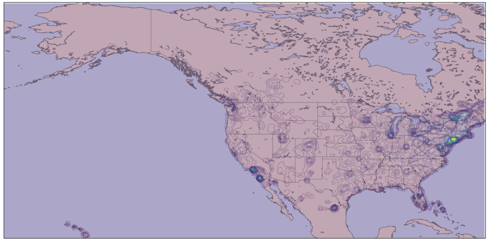

This snippet uses KDE (kernel density estimation) to create a heat map. This is essentially a generic version of the code in this wonderful post: https://jakevdp.github.io/PythonDataScienceHandbook/05.13-kernel-density-estimation.html


```python
def kde_heatmap(latlong_points, long_min, long_max, lat_min, lat_max, grid_granularity=0.5, bandwidth=0.01, levels_granularity=100):
    long_range = np.arange(long_min, long_max, grid_granularity)
    lat_range = np.arange(lat_min, lat_max, grid_granularity)
    
    X, Y = np.meshgrid(long_range, lat_range)
    xy = np.radians(np.vstack([Y.ravel(), X.ravel()]).T)
    kde = KernelDensity(bandwidth=bandwidth, metric='haversine', kernel='linear')
    kde.fit(np.radians(latlong_points))
    density = np.exp(kde.score_samples(xy))
    
    Z = density.reshape(X.shape)
    levels = np.linspace(0, Z.max(), levels_granularity)
    
    plt.figure(figsize=(20, 20))

    m = Basemap(projection='cyl', resolution='i',
                llcrnrlat=lat_min, urcrnrlat=lat_max,
                llcrnrlon=long_min, urcrnrlon=long_max)
    m.drawmapboundary(fill_color='#DDEEFF')
    m.fillcontinents(color='#FFEEDD')
    m.drawcoastlines(color='gray', zorder=2)
    m.drawcountries(color='gray', zorder=2)
    # m.readshapefile('st99_d00', 'states', drawbounds=True, linewidth=0.45, color='gray')

    m.contourf(X, Y, Z, levels=levels, zorder=3, alpha=0.3)
``` 

Here's what the output looks like on a dataset of Airbnb listings in North America, once you've removed the 10000 cities with most listings. I did this to see where less popular destinations are located.



Essentially KDE is a "less contrived" version of a histogram. If there are $N$ data points and we have no prior knowledge, then our best bet is to assign each point a probability mass of $1/N$. This is what the ECDF does. However, KDE says that we shouldn't just concentrate all that mass at one point. Instead, that mass should be spread out around each point by using a "kernel function", which can range from a rectangle to a normal distribution-looking thing. 

In my experience, the choice of kernel function doesn't make much of a difference. I would only recommend against using a kernel like Gaussian (even though it is the default) because it is computationally expensive. When you have a bunch of data points, it makes a big difference. Here we are using the `linear` kernel for speed purposes.

Besides kernel, there are a few other adjustable parameters in the function signature. The `grid_granularity` controls how far apart grid points are. The KDE will produce a function $f: \mathbb{R}^2 \rightarrow \mathbb{R}$, but the best we can do in real life is evaluate $f$ on a grid. The `bandwidth` is how skinny or fat each kernel function is. Too skinny, and you end up overfitting the data, but too fat and you end up smoothing out too many of the features. This parameter is important to play around with. The last parameter is `levels_granularity`, which is just how many evenly spaced level curves of the function you want to plot. I haven't played around much with these parameters, so maybe they make a difference.

The last thing worth mentioning is that you have to be really careful about the order of lat and long, or else your pictures may turn out weird. This function accepts **lat first, then long**. The annoying thing is that KDE requires lat, long because the haversine function in `sklearn` requires that order, but basemap generally expects long, lat. This tripped me up for awhile.

Finally, you need to do some extra work to get things to turn out the way it did for me.

1. If you want high-resolution maps, you need to install an extra package using `conda install basemap-data-hires`
2. If you're plotting the USA and want state lines, you need to download the following 3 files, `st99_d00.dbf, st99_d00.shp, st99_d00.shx`, and put them in the path of your code. I found them here: https://github.com/matplotlib/basemap/tree/master/examples.

Hope that helps! I think `basemap` is a very powerful map tool. Even though it's really old, I haven't been able to find anything better. Let me know if you know of a newer package for doing this kind of stuff.

