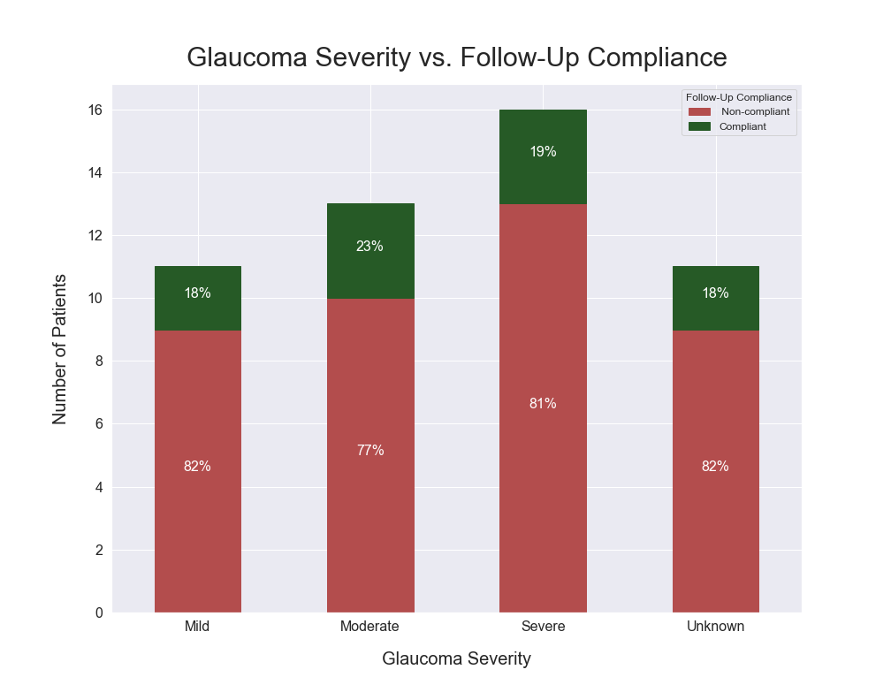

Here is a code snippet that demonstrates how to create a barplot with percentages.

```python
import pandas as pd
import seaborn as sns
import matplotlib.pyplot as plt

sns.set(rc={'figure.figsize':(14,11)})
plt.rcParams['xtick.labelsize']=16
plt.rcParams['ytick.labelsize']=16
plt.rc('legend',fontsize=12)

spal = sns.color_palette(['red', 'green'], desat=.4)
color_list = [spal[0]]*4 + [spal[1]]*4 

counts = df.groupby('glc_severity')['compliance_str'].value_counts().unstack()
percentage = counts.divide(counts.sum(axis = 1), axis = 0)


ax = counts.plot.bar(stacked=True, rot=0)
ax.set_xlabel("Glaucoma Severity", fontsize=20, labelpad=20)
ax.set_ylabel("Number of Patients", fontsize=20, labelpad=20)
ax.set_title("Glaucoma Severity vs. Follow-Up Compliance", fontsize=30, pad=20)
legend = ax.get_legend()
legend.set_title('Follow-Up Compliance')

legend.legendHandles[0].set_color(spal[0])
legend.legendHandles[1].set_color(spal[1])

for p, frac, color in zip(ax.patches, percentage.T.values.reshape(-1), color_list):
    width = p.get_width()
    height = p.get_height()
    x, y = p.get_xy() 
    p.set_color(color)
    ax.annotate(f'{frac:.0%}', (x + width/2, y + height*0.5), ha='center', fontsize=16, color='white')

plt.savefig('followup.png')
```

The result looks like this:



The data that I'm using isn't so important. I think the three things to take from this are:

1. How to make font size modifications to any part of the graph.
2. How to make color palette modifications, and easily define muted palettes with Seaborn.
3. How to put percentages on the middle of the bar graphs.