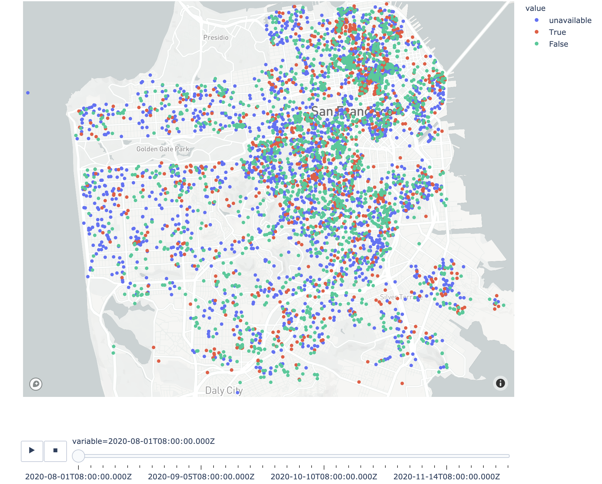

This snippet uses Plotly to create a Mapbox map with a slider. 

```python
import plotly.express as px
import pandas as pd

def create_map_scatter(df, values, zoom=11):
    # fill NaNs for the plot to work
    df.fillna("unavailable", inplace=True)
    df = pd.melt(df, id_vars=['index', 'publicAddress', 'lat', 'long', 'name', 'reviewsCount', 'personCapacity'], 
    value_vars=values)
    
    return px.scatter_mapbox(df, 
        lat="lat", 
        lon="long", 
        color='value',
        height=850,
        animation_frame='variable',
        animation_group='index',
        hover_data=['name', 'reviewsCount', 'personCapacity'],
        zoom=zoom)
```

This map allows me to look at Airbnb rentals over a specified time frame. It looks something like this:



The `animation_frame` and `animation_group` properties are doing the heavy lifting here. It would take about 50 to 100 lines of code to add a slider and buttons otherwise. In order to make everything work, you need to melt your dataframe columns. If you want your slider to iterate through columns, then the melted columns become your `animation_frame`.

In general, Plotly Express helps you create complex graphs with a few lines of code. You can achieve the same results by manually specifying your Layouts and Data and such, but it takes way more code. The only downside is that you lose out on is flexibility. Another downside that I struggled with the most was lag. There are about ~1 million Airbnb listings in the United States (as of now), and about 4 months worth of days that I am interested in looking at. This is enough data to make `px.scatter_mapbox` explode.

To make things manageable, I did two things:

1. Select one location (e.g. San Francisco) at a time to look at.
2. Look at weekends only.

The main optimization that can be done here is to only change the color of the marker as you iterate through days, since the locations are constant. Unfortunately, Plotly does not currently support this feature. Read this thread for more information: https://community.plotly.com/t/is-it-possible-to-update-just-layout-not-whole-figure-of-graph-in-callback/8300/14.

I think the dream is to eventually be able to update properties of arbitrary subcomponents of a figure using dash callbacks with "magic underscore notation." So something like `@app.callback(dash.dependencies.Output('map','figure_data_markers_color') ...` for this example.

However, I have no complaints about the current functionality. Dash and Plotly are very powerful tools, and in just a few days I've been able to learn the framework and create some cool stuff. In regards to the last post, they also support KDE map plots with all the flexibility that Mapbox provides. All in all, these libraries are great.
